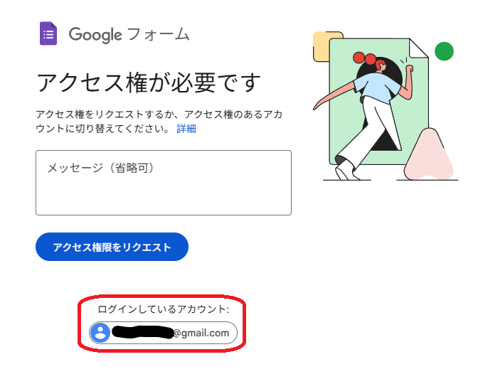

## [入部フォーム](https://docs.google.com/forms/d/e/1FAIpQLSc5PLg3PhXZa6Z3YCt9aXJVv_rmWcJHTMFbwovR8RTdJQ61fw/viewform)
- [OSU電研入部フォーム - Googleフォーム](https://docs.google.com/forms/d/e/1FAIpQLSc5PLg3PhXZa6Z3YCt9aXJVv_rmWcJHTMFbwovR8RTdJQ61fw/viewform)

※上記のリンクは大学のGoogleアカウントでアクセスしてください。

「返信に表示するメールアドレスとして (ユーザー名)@ge.osaka-sandai.ac.jp を記録する」のチェックボックスにチェックを入れて「送信」ボタンをクリックすることで送信できます。 
こちら（電子計算研究部）にて確認でき次第、電子メールにて返答します。

### アクセス権が必要です と表示された場合

上記に記載している画像にて、赤線で囲っている部分を選択して大阪産業大学から付与されているGoogleアカウントに切り替えてください。 
この入部フォームではそれ以外のGoogleアカウントではアクセスできない設定にしています。

## [X (旧Twitter)](https://x.com/osu_denken)
- [@OSU_denken - X](https://x.com/osu_denken)
